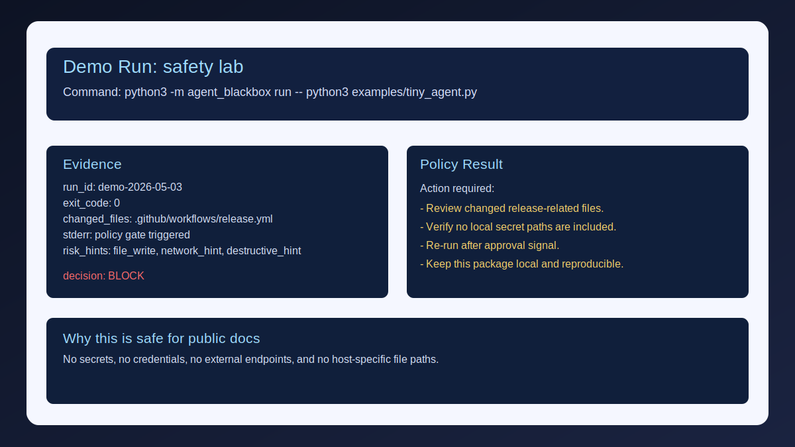

# Agent Blackbox

[](https://github.com/xXNewbiXx/agent-blackbox/actions/workflows/ci.yml)

> Flight recorder for local AI agents. See exactly what your agent did, changed, and broke.

**Thesis:** If your AI agent doesn't have a blackbox, it shouldn't touch production.

Agent Blackbox wraps any local agent or script and records a replayable audit trail: command, stdout/stderr, changed files, git diff, timestamps, exit code, and risk hints. It is not another autonomous agent. It is the accountability layer for all of them.



## Quickstart

```bash
agent-blackbox run -- python3 examples/tiny_agent.py
agent-blackbox view
agent-blackbox policy "$(cat .agent-blackbox/latest)/run.json"
agent-blackbox --version
```

## What gets recorded
- user-started command metadata
- stdout/stderr
- git status before/after
- git diff after the run
- changed file list
- process exit code and duration
- risk hints: `file_write`, `network_hint`, `secrets_hint`, `destructive_hint`, `stderr_output`

## What does not happen
- no cloud upload
- no background spying
- no autonomous execution
- no self-modifying agent behavior
- no secret collection by design
- no claim that all harm is prevented

## Positioning
- GitHub hook: Wrap any agent command and get a replayable audit trail.
- Investor hook: Sentry/Datadog-style observability for autonomous AI work.
- Safety hook: More autonomy without observability is negligence.

## Roadmap
OpenTelemetry export, GitHub Actions artifact mode, VS Code extension, team run sharing, secret scanner integration, policy checks before merge.

## Docs
- [Run artifact schema](docs/RUN_SCHEMA.md)
- [Security and responsible use](SECURITY.md)
- [Market niches and acquisition hooks](docs/MARKET_NICHES.md)
- [Launch pack](docs/LAUNCH.md)
- [Outreach pack](docs/OUTREACH.md)
- [Posting queue](docs/POSTING_QUEUE.md)
- [Command wrapper examples](docs/EXAMPLES.md)
- [Policy gates](docs/POLICY_GATES.md)
- [Demo pack](docs/DEMO_PACK.md)

## License
MIT
